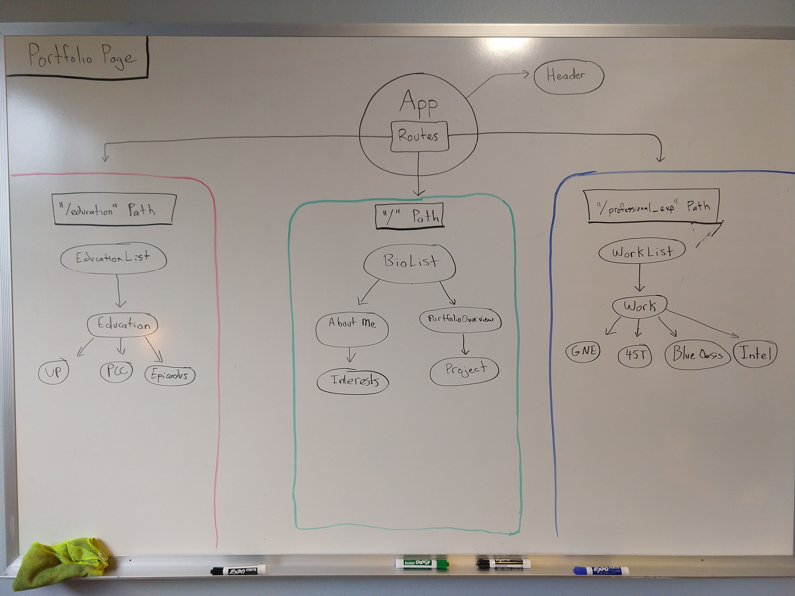

# _Portfolio_

## _A portfolio page, written in React, that describes myself and my career interests._

### By _**Robert Bruce**_

## Setup/Installation Requirements

### To view this portfolio

* navigate to my [deployed page]({placedeployed site here})

### To use source code as template for your own profile page

* Clone this repo

```bash
git clone https://github.com/entegral/reactPortfolio.git
```

* Install dependencies and start server

```bash
npm install && npm run start
```

* Navigate to [site](http://localhost:8080) in browswer 

## Component Layout



## Support and contact details

Robert Bruce:
  email: e2robby@gmail.com

  Github: https://github.com/entegral

## Technologies Used

React, react-hot-loader, react-router, materialize, webpack, eslint, styled-jsx, babel, 

### License

MIT Copyright (c) 2019 **_Robert Bruce_**